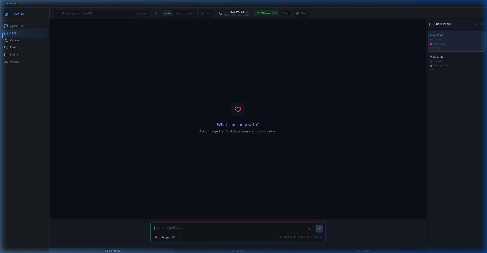
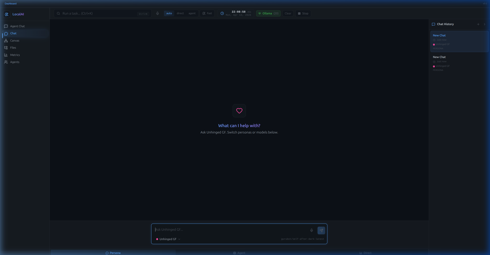

# AI IDE Upgrades: Walkthrough

I've successfully implemented all of the features outlined in the implementation plan! Here is an overview of what was built and how it fundamentally improves the AI workflow.

## 1. Multi-Coder Project Orchestration 🧠

**The Problem:** Previously, asking the IDE to build anything with code strictly bypassed the `planner` step and instantly assigned everything to a monolithic `coder` agent. This caused complex tasks like "build a fullstack dynamic web app" to get completely stuck because it was too large for one prompt loop.

**The Solution:** 
- I updated the routing logic in `router.py`. Now, if a task contains complexity indicators (like "fullstack", "dynamic", "large", or is a long detailed prompt), it correctly relies on the LLM Planner.
- I completely revamped `planner.md`. The planner will now break down complex builds into logical sequences of `coder` tasks (e.g., Step 1: `coder` builds Backend, Step 2: `tool` saves files, Step 3: `coder` builds Frontend UI, etc.).
- **Crucial Core Upgrade:** I heavily modified `orchestrator.py` and `tool.py` natively. The orchestrator now processes sequential file-saving inside the execution loop. `tool.py` was rebuilt to natively append and merge file updates safely into your `project.json` tracker without accidentally overwriting the previous coder's files.

## 2. Mandatory README & Production Code 📝

**The Solution:** 
- I updated the `coder.md` instructions to explicitly enforce the creation of a `README.md` file whenever a project is made. 
- I specifically banned the generation of overly simple placeholder scripts (like one-line "hello world" scripts) unless specifically requested, instructing the model to default to generating proper project architectures and boilerplates.

## 3. High-Precision Top Dock Clock ⏱️

**The Solution:** 
- Created a new React component `<TopClock />` using `requestAnimationFrame`.
- It now elegantly displays the real-time exact hours, minutes, seconds, milliseconds, day of the week, month, and year natively in the top right corner of the `Dashboard.jsx`.

## 4. Simple Chat Voice Integration 🎙️

**The Solution:** 
- Replicated the `<VoiceButton />` functionality exactly as it exists in the Agent Chat. You can now use dictated voice-to-text directly from the Simple Chat interface.

## 5. Mystery of the "Missing" Chat History 🕵️‍♂️

**The Investigation:**
- You mentioned you had chatted extensively in "Agent Chat", but couldn't find your history. 
- **The Finding:** `Simple Chat` *does* have a history panel! However, `Simple Chat` and `Agent Chat` use two totally disconnected databases. Agent Chat stores its history completely locally in your browser's localstorage (`useAgentChatHistoryStore.js`), whereas Simple Chat uses the Python backend database (`useSimpleChatHistoryStore.js`). Your Agent chats are still there if you go to Agent Chat, and your simple chats are there in Simple Chat, they just don't bridge over conceptually! 

## 6. Websocket Drop Indicator 🔌

**The Solution:**
- I updated the `ConnectionStatus` badge code inside `Dashboard.jsx` so it doesn't just quietly drop the real-time websocket (`/ws/agent-stream`) when the Vite Proxy times it out. Instead, it will immediately display `Connecting` natively in the top right so you have visual confirmation that the connection momentarily severed but is actively resolving itself.
